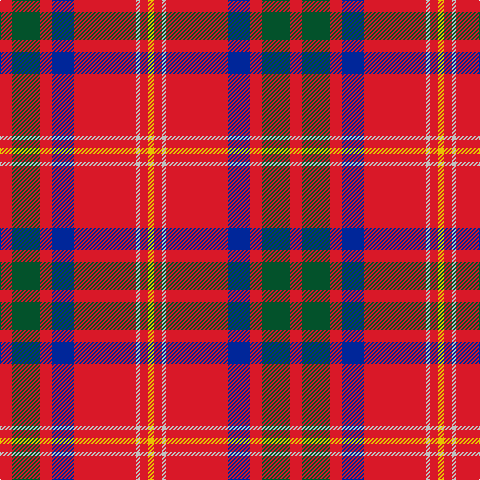

The parent of this is [Loch Lochy](/tartans/r/12/g28/r12/db22/r62/n4/r8/y/6/)

This was sourced from register-of-tartans.  It is a [8 stripes tartan](/stripes/stripes8/).

Original link https://www.tartanregister.gov.uk/tartanDetails.aspx?ref=10768

## Thread count
R/12 G28 R12 DB22 R62 N4 R8 Y/6

## Palette
Each colour and its ΔE from the base-6 reference it is a variant of.

| Colour | Shade | Base | ΔE (OKLab) |
|---|---|---|---|
| DB |  `#002699` | B  | 0.09 |
| G |  `#03522B` | G  | 0.08 |
| N |  `#C0C0C0` | W  | 0.16 |
| R |  `#D91828` | R  | 0.04 |
| Y |  `#E8C000` | Y  | 0.00 |

# Sample pattern

ID: /variants/r/12/g28/r12/db22/r62/n4/r8/y/6-db002699-g03522b-nc0c0c0-rd91828-ye8c000/
