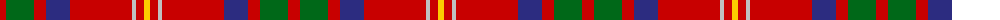

The parent of this is [Loch Lochy (District)](/tartans/r/12/g28/r12/db24/r62/n4/r8/y/6/)

This was sourced from tartans-authority.  It is a [8 stripes tartan](/stripes/stripes8/).

Original link http://www.tartansauthority.com/tartan-ferret/display/10768/

## Thread count
R/12 G28 R12 DB24 R62 N4 R8 Y/6

## Palette
Each colour and its ΔE from the base-6 reference it is a variant of.

| Colour | Shade | Base | ΔE (OKLab) |
|---|---|---|---|
| DB |  `#2C2C80` | B  | 0.05 |
| G |  `#006818` | G  | 0.02 |
| N |  `#C0C0C0` | W  | 0.16 |
| R |  `#C80000` | R  | 0.00 |
| Y |  `#FCCC00` | Y  | 0.04 |

# Sample pattern

ID: /variants/r/12/g28/r12/db24/r62/n4/r8/y/6-db2c2c80-g006818-nc0c0c0-rc80000-yfccc00/
