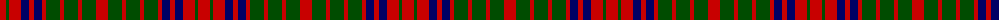

The parent of this is [Grant of Monymusk](/tartans/r/12/g3/r12/db8/r5/db8/r4/g14/r4/g14/r4/g14/r/12/)

This was sourced from weddslist.  It is a [13 stripes tartan](/stripes/stripes13/).

Original link http://www.weddslist.com/cgi-bin/tartans/pg.pl?source=rb

## Thread count
R/12 G3 R12 DB8 R5 DB8 R4 G14 R4 G14 R4 G14 R/12

## Palette
Each colour and its ΔE from the base-6 reference it is a variant of.

| Colour | Shade | Base | ΔE (OKLab) |
|---|---|---|---|
| DB |  `#000064` | B  | 0.17 |
| G |  `#004C00` | G  | 0.08 |
| R |  `#C80000` | R  | 0.00 |

ID: /variants/r/12/g3/r12/db8/r5/db8/r4/g14/r4/g14/r4/g14/r/12-db000064-g004c00-rc80000/
