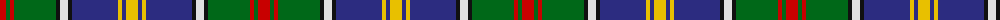

The parent of this is [Culture The... Corporate Tartan Tartan Number: 1534. Earliest known date: 1989 Colours chosen to reflect a European essence that will endure beyond the 1990 'Year of Culture'. Supply and manufacture only at MacDonald MacKay (Kiltmakers) Ltd., Glasgow. See products available Copyright © Blair Urquhart, Comrie, 2015](/tartans/r/12/g4/r4/g42/k4/ln8/k4/db46/y4/db4/y/12/)

This was sourced from house-of-tartan.  It is a [11 stripes tartan](/stripes/stripes11/).

Original link http://www.house-of-tartan.scotland.net/house/TartanViewjs.asp?colr=Def&tnam=1534

## Thread count
R/12 G4 R4 G42 K4 LN8 K4 DB46 Y4 DB4 Y/12

## Palette
Each colour and its ΔE from the base-6 reference it is a variant of.

| Colour | Shade | Base | ΔE (OKLab) |
|---|---|---|---|
| DB |  `#2C2C80` | B  | 0.05 |
| G |  `#006818` | G  | 0.02 |
| K |  `#101010` | K  | 0.17 |
| LN |  `#E0E0E0` | W  | 0.06 |
| R |  `#C80000` | R  | 0.00 |
| Y |  `#E8C000` | Y  | 0.00 |

ID: /variants/r/12/g4/r4/g42/k4/ln8/k4/db46/y4/db4/y/12-db2c2c80-g006818-k101010-lne0e0e0-rc80000-ye8c000/
