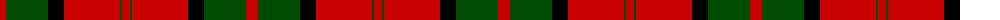
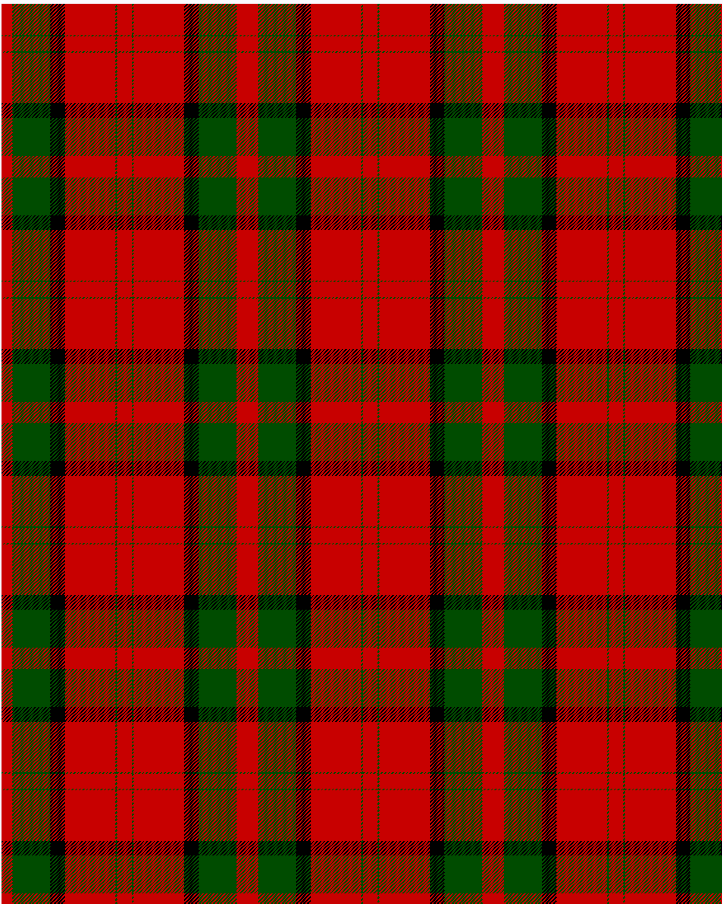

The parent of this is [Dunbar](/tartans/r/12/g42/k16/r56/g2/r/8/)

This was sourced from <no value>.  It is a [6 stripes tartan](/stripes/stripes6/).

Original link http://www.weddslist.com/cgi-bin/tartans/pg.pl?source=rb

## Thread count
R/12 G42 K16 R56 G2 R/8

## Palette
G K R

# Sample pattern

ID: /variants/r/12/g42/k16/r56/g2/r/8-g004c00-k000000-rc80000/