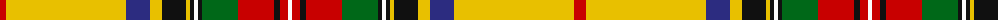

The parent of this is [Victoria,Yellow (Fashion)](/tartans/r/12/y120/db24/y12/k24/y4/k4/w4/k4/g36/r36/k6/r8/w/4/)

This was sourced from tartans-authority.  It is a [14 stripes tartan](/stripes/stripes14/).

Original link http://www.tartansauthority.com/tartan-ferret/display/1712/

## Thread count
R/12 Y120 DB24 Y12 K24 Y4 K4 W4 K4 G36 R36 K6 R8 W/4

## Palette
Each colour and its ΔE from the base-6 reference it is a variant of.

| Colour | Shade | Base | ΔE (OKLab) |
|---|---|---|---|
| DB |  `#2C2C80` | B  | 0.05 |
| G |  `#006818` | G  | 0.02 |
| K |  `#101010` | K  | 0.17 |
| R |  `#C80000` | R  | 0.00 |
| W |  `#FCFCFC` | W  | 0.03 |
| Y |  `#E8C000` | Y  | 0.00 |

ID: /variants/r/12/y120/db24/y12/k24/y4/k4/w4/k4/g36/r36/k6/r8/w/4-db2c2c80-g006818-k101010-rc80000-wfcfcfc-ye8c000/
