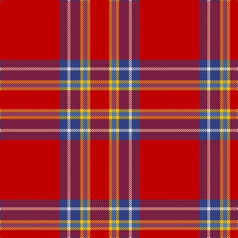

The parent of this is [Princess Elizabeth](/tartans/r/120/b16/ln6/b20/y6/ba8/y6/r/38/)

This was sourced from weddslist.  It is a [8 stripes tartan](/stripes/stripes8/).

Original link http://www.weddslist.com/cgi-bin/tartans/pg.pl?source=sts

## Thread count
R/120 B16 LN6 B20 Y6 Ba8 Y6 R/38

## Palette
Each colour and its ΔE from the base-6 reference it is a variant of.

| Colour | Shade | Base | ΔE (OKLab) |
|---|---|---|---|
| B |  `#304080` | B  | 0.01 |
| Ba |  `#5480B0` | B  | 0.20 |
| LN |  `#E0E0E0` | W  | 0.06 |
| R |  `#C00000` | R  | 0.02 |
| Y |  `#F0C000` | Y  | 0.01 |

# Sample pattern

ID: /variants/r/120/b16/ln6/b20/y6/ba8/y6/r/38-b304080-ba5480b0-lne0e0e0-rc00000-yf0c000/
