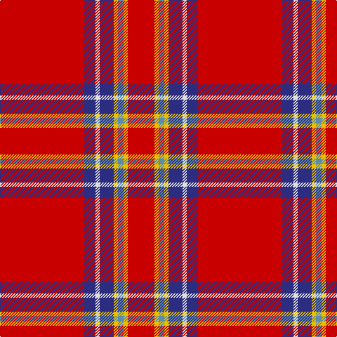

The parent of this is [Princess Elizabeth Royal Family Tartan Tartan Number: 1444. Earliest known date: pre 2003 Also Earl of Inverness See products available Copyright © Blair Urquhart, Comrie, 2015](/tartans/r/120/db16/ln6/db20/y6/b8/y6/r/38/)

This was sourced from house-of-tartan.  It is a [8 stripes tartan](/stripes/stripes8/).

Original link http://www.house-of-tartan.scotland.net/house/TartanViewjs.asp?colr=Def&tnam=1444

## Thread count
R/120 DB16 LN6 DB20 Y6 B8 Y6 R/38

## Palette
Each colour and its ΔE from the base-6 reference it is a variant of.

| Colour | Shade | Base | ΔE (OKLab) |
|---|---|---|---|
| B |  `#5C8CA8` | B  | 0.23 |
| DB |  `#2C2C80` | B  | 0.05 |
| LN |  `#E0E0E0` | W  | 0.06 |
| R |  `#C80000` | R  | 0.00 |
| Y |  `#E8C000` | Y  | 0.00 |

# Sample pattern

ID: /variants/r/120/db16/ln6/db20/y6/b8/y6/r/38-b5c8ca8-db2c2c80-lne0e0e0-rc80000-ye8c000/
