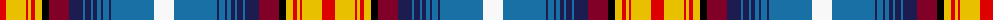

The parent of this is [Declaration of Scottish Independence, Arbroath 1320](/tartans/r/13/y20/r2/y3/r4/y7/k7/dr20/db14/b2/db6/b2/db4/b4/db2/b6/db2/b43/w/20/)

This was sourced from register-of-tartans.  It is a [19 stripes tartan](/stripes/stripes19/).

Original link https://www.tartanregister.gov.uk/tartanDetails.aspx?ref=11182

## Thread count
R/13 Y20 R2 Y3 R4 Y7 K7 DR20 DB14 B2 DB6 B2 DB4 B4 DB2 B6 DB2 B43 W/20

## Palette
Each colour and its ΔE from the base-6 reference it is a variant of.

| Colour | Shade | Base | ΔE (OKLab) |
|---|---|---|---|
| B |  `#1870A4` | B  | 0.14 |
| DB |  `#1C1C50` | B  | 0.14 |
| DR |  `#800028` | R  | 0.16 |
| K |  `#000000` | K  | 0.00 |
| R |  `#DC0000` | R  | 0.04 |
| W |  `#F8F8F8` | W  | 0.01 |
| Y |  `#E8C000` | Y  | 0.00 |

ID: /variants/r/13/y20/r2/y3/r4/y7/k7/dr20/db14/b2/db6/b2/db4/b4/db2/b6/db2/b43/w/20-b1870a4-db1c1c50-dr800028-k000000-rdc0000-wf8f8f8-ye8c000/
