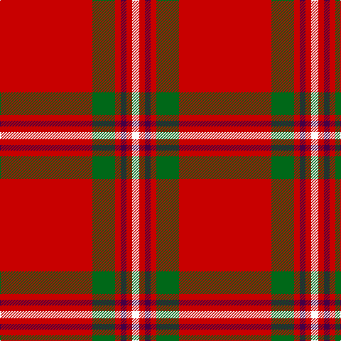

The parent of this is [Howard, Vincent (Personal)](/tartans/r/130/g32/r8/dp8/r8/w/10/)

This was sourced from tartans-authority.  It is a [6 stripes tartan](/stripes/stripes6/).

Original link http://www.tartansauthority.com/tartan-ferret/display/11067/

## Thread count
R/130 G32 R8 DP8 R8 W/10

## Palette
Each colour and its ΔE from the base-6 reference it is a variant of.

| Colour | Shade | Base | ΔE (OKLab) |
|---|---|---|---|
| DP |  `#440044` | B  | 0.17 |
| G |  `#006818` | G  | 0.02 |
| R |  `#C80000` | R  | 0.00 |
| W |  `#FCFCFC` | W  | 0.03 |

# Sample pattern

ID: /variants/r/130/g32/r8/dp8/r8/w/10-dp440044-g006818-rc80000-wfcfcfc/
