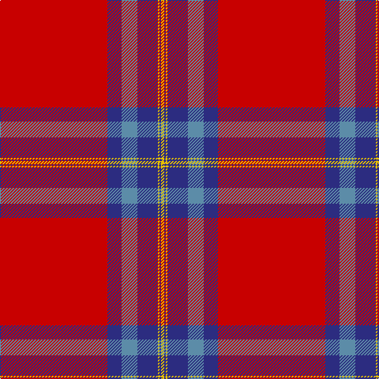

The parent of this is [Canadian Legion Branch 50 Corporate Tartan Tartan Number: 1327. Earliest known date: pre 2003 From a study of the portrait of Lord Loudoun (c 1747) outlined in the proceedings of the STS See products available Copyright © Blair Urquhart, Comrie, 2015](/tartans/r/136/db18/b20/db26/y2/db2/y/4/)

This was sourced from house-of-tartan.  It is a [7 stripes tartan](/stripes/stripes7/).

Original link http://www.house-of-tartan.scotland.net/house/TartanViewjs.asp?colr=Def&tnam=1327

## Thread count
R/136 DB18 B20 DB26 Y2 DB2 Y/4

## Palette
Each colour and its ΔE from the base-6 reference it is a variant of.

| Colour | Shade | Base | ΔE (OKLab) |
|---|---|---|---|
| B |  `#5C8CA8` | B  | 0.23 |
| DB |  `#2C2C80` | B  | 0.05 |
| R |  `#C80000` | R  | 0.00 |
| Y |  `#E8C000` | Y  | 0.00 |

# Sample pattern

ID: /variants/r/136/db18/b20/db26/y2/db2/y/4-b5c8ca8-db2c2c80-rc80000-ye8c000/
