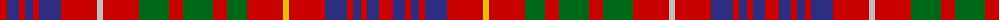

The parent of this is [Fox, Red (Name)](/tartans/r/14/db12/r6/db8/r6/db22/r36/n6/r36/g30/r14/g30/r14/g20/r36/y6/r36/db22/r6/db8/r6/db12/r/14/)

This was sourced from tartans-authority.  It is a [23 stripes tartan](/stripes/stripes23/).

Original link http://www.tartansauthority.com/tartan-ferret/display/6312/

## Thread count
R/14 DB12 R6 DB8 R6 DB22 R36 N6 R36 G30 R14 G30 R14 G20 R36 Y6 R36 DB22 R6 DB8 R6 DB12 R/14

## Palette
Each colour and its ΔE from the base-6 reference it is a variant of.

| Colour | Shade | Base | ΔE (OKLab) |
|---|---|---|---|
| DB |  `#2C2C80` | B  | 0.05 |
| G |  `#006818` | G  | 0.02 |
| N |  `#C0C0C0` | W  | 0.16 |
| R |  `#C80000` | R  | 0.00 |
| Y |  `#E8C000` | Y  | 0.00 |

ID: /variants/r/14/db12/r6/db8/r6/db22/r36/n6/r36/g30/r14/g30/r14/g20/r36/y6/r36/db22/r6/db8/r6/db12/r/14-db2c2c80-g006818-nc0c0c0-rc80000-ye8c000/
