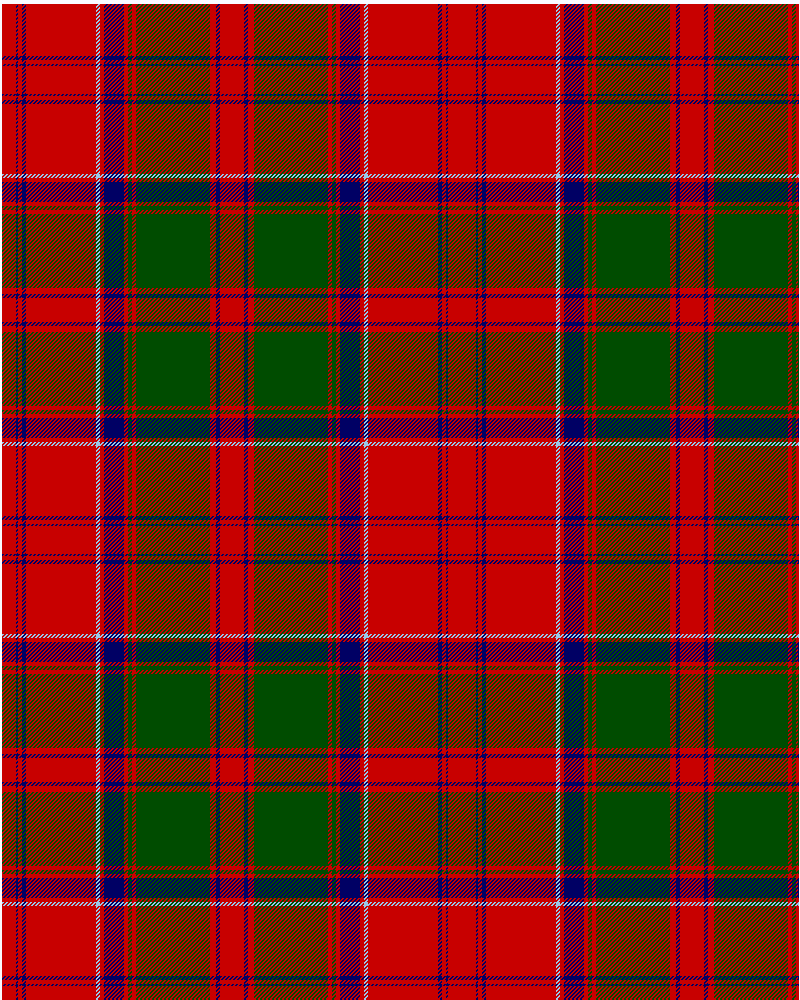

The parent of this is [Drummond of Megginch 1849 Kilt](/tartans/r/14/db2/r4/db4/r70/lb4/r4/db20/r4/g4/r4/g74/r6/db4/r/12/)

This was sourced from <no value>.  It is a [15 stripes tartan](/stripes/stripes15/).

Original link https://tartandictionary.org/posts/drummondsofmeggincholdkilt/

## Thread count
R/14 DB2 R4 DB4 R70 LB4 R4 DB20 R4 G4 R4 G74 R6 DB4 R/12

## Palette
DB G LB R

# Sample pattern

ID: /variants/r/14/db2/r4/db4/r70/lb4/r4/db20/r4/g4/r4/g74/r6/db4/r/12-db000064-g004c00-lb98c8e8-rc80000/