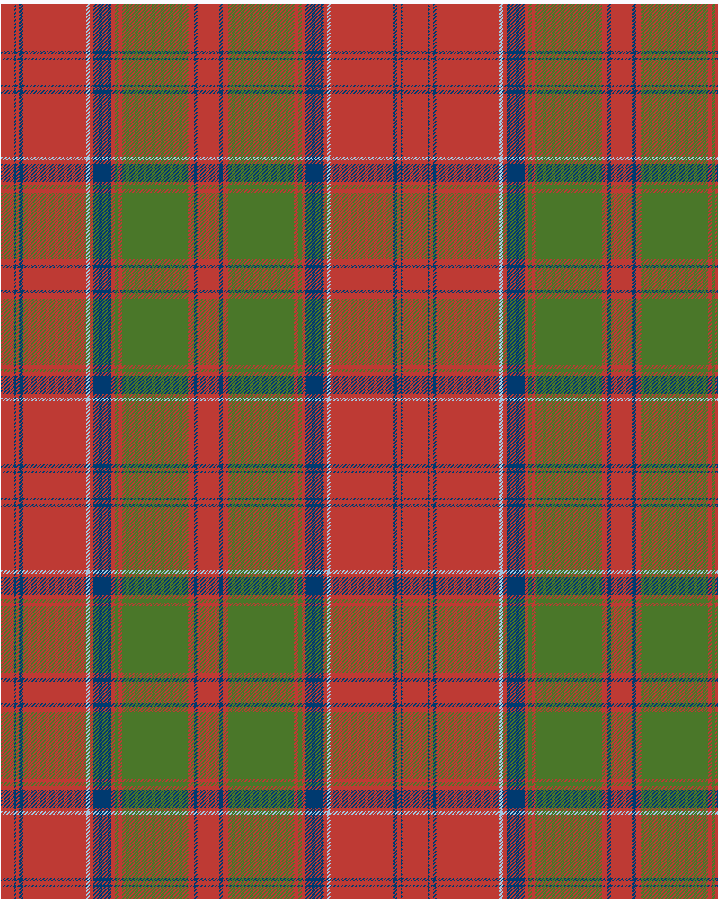

Drummond of Megginch 1849 Kilt

Drummond of Megginch 2022 Proposal

This was sourced from <no value>.  It is a 15 stripes tartan.

Original link https://tartandictionary.org/posts/drummondsofmegginchproposal//

## Thread count
R/14 DB2 R4 DB4 R70 LB4 R4 DB20 R4 G4 R4 G74 R6 DB4 R/12

## Palette
DB#003A70 G#4A7729 LB#A4C8E1 R#BE3A34

# Sample pattern

ID: /variants/r/14/db2/r4/db4/r70/lb4/r4/db20/r4/g4/r4/g74/r6/db4/r/12-db003a70-g4a7729-lba4c8e1-rbe3a34/