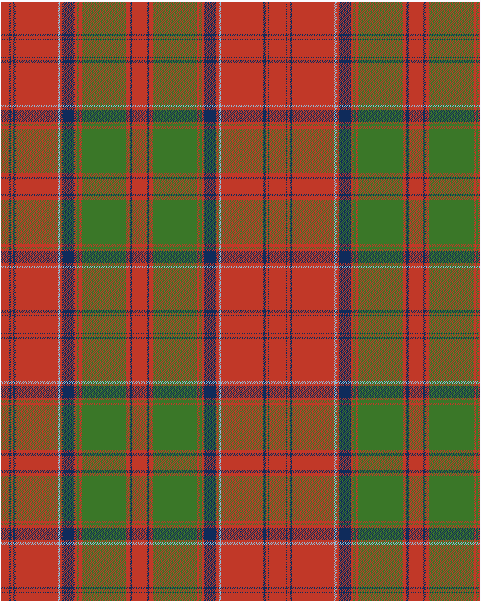

Drummond of Megginch 1849 Kilt

Drummond of Megginch 2023 BertieLexa Kilt

This was sourced from <no value>.  It is a 15 stripes tartan.

Original link https://tartandictionary.org/posts/drummondsofmeggincholdkilt/

## Thread count
R/14 DB2 R4 DB4 R70 LB4 R4 DB20 R4 G4 R4 G74 R6 DB4 R/12

## Palette
DB#0F2B5B G#3A7728 LB#93B7D1 R#C13828

# Sample pattern

ID: /variants/r/14/db2/r4/db4/r70/lb4/r4/db20/r4/g4/r4/g74/r6/db4/r/12-db0f2b5b-g3a7728-lb93b7d1-rc13828/