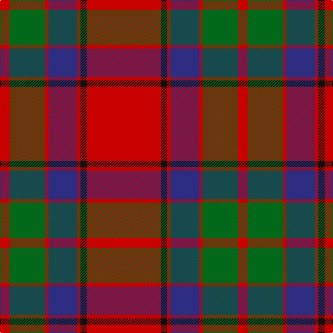

The parent of this is [Buccleuch Family Tartan Tartan Number: 1505. Earliest known date: c.1840 Reduced 50% proportionally. Described by Wilson as a 'Fancy' pattern, taking inspiration from the works of Sir Walter Scott. See products available Copyright © Blair Urquhart, Comrie, 2015](/tartans/r/14/g51/r5/db41/r5/k9/r/107/)

This was sourced from house-of-tartan.  It is a [7 stripes tartan](/stripes/stripes7/).

Original link http://www.house-of-tartan.scotland.net/house/TartanViewjs.asp?colr=Def&tnam=1505

## Thread count
R/14 G51 R5 DB41 R5 K9 R/107

## Palette
Each colour and its ΔE from the base-6 reference it is a variant of.

| Colour | Shade | Base | ΔE (OKLab) |
|---|---|---|---|
| DB |  `#2C2C80` | B  | 0.05 |
| G |  `#006818` | G  | 0.02 |
| K |  `#101010` | K  | 0.17 |
| R |  `#C80000` | R  | 0.00 |

# Sample pattern

ID: /variants/r/14/g51/r5/db41/r5/k9/r/107-db2c2c80-g006818-k101010-rc80000/
