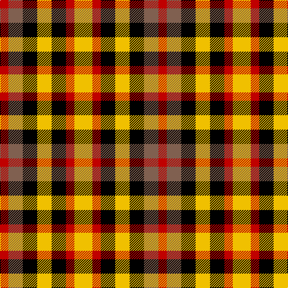

The parent of this is [Duffus, Lord](/tartans/r/14/lt24/k24/y24/k24/r14/y/30/)

This was sourced from weddslist.  It is a [7 stripes tartan](/stripes/stripes7/).

Original link http://www.weddslist.com/cgi-bin/tartans/pg.pl?source=sts

## Thread count
R/14 LT24 K24 Y24 K24 R14 Y/30

## Palette
Each colour and its ΔE from the base-6 reference it is a variant of.

| Colour | Shade | Base | ΔE (OKLab) |
|---|---|---|---|
| K |  `#000000` | K  | 0.00 |
| LT |  `#806050` | R  | 0.17 |
| R |  `#C00000` | R  | 0.02 |
| Y |  `#F0C000` | Y  | 0.01 |

# Sample pattern

ID: /variants/r/14/lt24/k24/y24/k24/r14/y/30-k000000-lt806050-rc00000-yf0c000/
