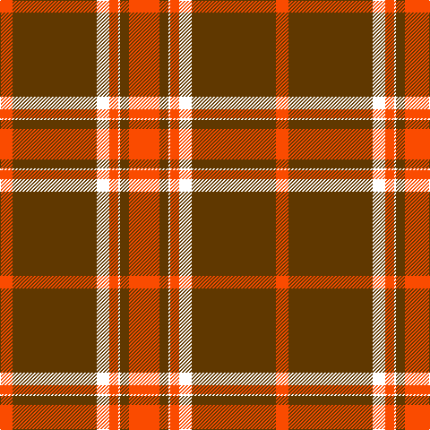

The parent of this is [Pride of Cleveland Fall](/tartans/r/14/t94/w14/r10/w2/t10/r/34/)

This was sourced from register-of-tartans.  It is a [7 stripes tartan](/stripes/stripes7/).

Original link https://www.tartanregister.gov.uk/tartanDetails.aspx?ref=11309

## Thread count
R/14 T94 W14 R10 W2 T10 R/34

## Palette
Each colour and its ΔE from the base-6 reference it is a variant of.

| Colour | Shade | Base | ΔE (OKLab) |
|---|---|---|---|
| R |  `#FA4B00` | R  | 0.14 |
| T |  `#603800` | G  | 0.16 |
| W |  `#FFFFFF` | W  | 0.03 |

# Sample pattern

ID: /variants/r/14/t94/w14/r10/w2/t10/r/34-rfa4b00-t603800-wffffff/
