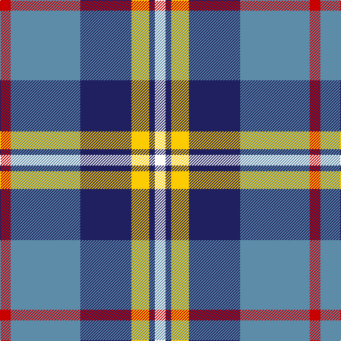

The parent of this is [Afternoon Tea / Earl Grey](/tartans/r/15/b98/db72/y25/db8/w/15/)

This was sourced from tartans-authority.  It is a [6 stripes tartan](/stripes/stripes6/).

Original link http://www.tartansauthority.com/tartan-ferret/display/11277/

## Thread count
R/15 B98 DB72 Y25 DB8 W/15

## Palette
Each colour and its ΔE from the base-6 reference it is a variant of.

| Colour | Shade | Base | ΔE (OKLab) |
|---|---|---|---|
| B |  `#5C8CA8` | B  | 0.23 |
| DB |  `#202060` | B  | 0.11 |
| R |  `#C80000` | R  | 0.00 |
| W |  `#FCFCFC` | W  | 0.03 |
| Y |  `#FCCC00` | Y  | 0.04 |

# Sample pattern

ID: /variants/r/15/b98/db72/y25/db8/w/15-b5c8ca8-db202060-rc80000-wfcfcfc-yfccc00/
