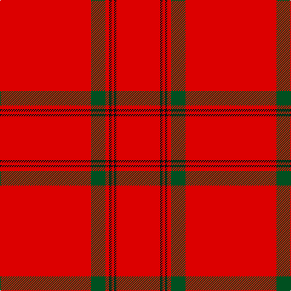

The parent of this is [MacKintosh #5](/tartans/r/150/g24/r6/k4/r4/k4/r/72/)

This was sourced from register-of-tartans.  It is a [7 stripes tartan](/stripes/stripes7/).

Original link https://www.tartanregister.gov.uk/tartanDetails.aspx?ref=2563

## Thread count
R/150 G24 R6 K4 R4 K4 R/72

## Palette
Each colour and its ΔE from the base-6 reference it is a variant of.

| Colour | Shade | Base | ΔE (OKLab) |
|---|---|---|---|
| G |  `#005020` | G  | 0.08 |
| K |  `#101010` | K  | 0.17 |
| R |  `#DC0000` | R  | 0.04 |

# Sample pattern

ID: /variants/r/150/g24/r6/k4/r4/k4/r/72-g005020-k101010-rdc0000/
