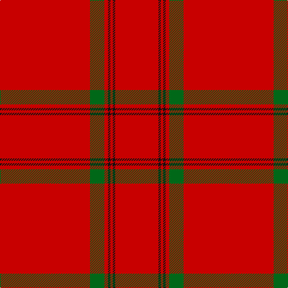

The parent of this is [MacKintosh (Moy Hall) Clan Tartan Tartan Number: 1509. Earliest known date: 1821 The Setts No: 253. Of the same pattern as a fragment in the Moy Hall collection claimed to be a part of a kilt worn by Prince Charles at the time of the '45. Author and weaver, James Scarlet, has investigated further and has found at least four other piec See products available Copyright © Blair Urquhart, Comrie, 2015](/tartans/r/150/g24/r6/k4/r4/k4/r/72/)

This was sourced from house-of-tartan.  It is a [7 stripes tartan](/stripes/stripes7/).

Original link http://www.house-of-tartan.scotland.net/house/TartanViewjs.asp?colr=Def&tnam=1509

## Thread count
R/150 G24 R6 K4 R4 K4 R/72

## Palette
Each colour and its ΔE from the base-6 reference it is a variant of.

| Colour | Shade | Base | ΔE (OKLab) |
|---|---|---|---|
| G |  `#006818` | G  | 0.02 |
| K |  `#101010` | K  | 0.17 |
| R |  `#C80000` | R  | 0.00 |

# Sample pattern

ID: /variants/r/150/g24/r6/k4/r4/k4/r/72-g006818-k101010-rc80000/
