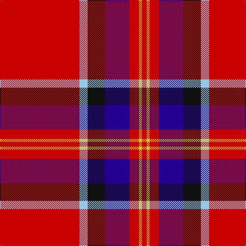

The parent of this is [Solberg-Wormald (Personal)](/tartans/r/155/lb16/k34/db48/r18/y6/r/9/)

This was sourced from tartans-authority.  It is a [7 stripes tartan](/stripes/stripes7/).

Original link http://www.tartansauthority.com/tartan-ferret/display/6661/

## Thread count
R/155 LB16 K34 DB48 R18 Y6 R/9

## Palette
Each colour and its ΔE from the base-6 reference it is a variant of.

| Colour | Shade | Base | ΔE (OKLab) |
|---|---|---|---|
| DB |  `#240090` | B  | 0.12 |
| K |  `#101010` | K  | 0.17 |
| LB |  `#98C8E8` | W  | 0.17 |
| R |  `#C80000` | R  | 0.00 |
| Y |  `#E8C000` | Y  | 0.00 |

# Sample pattern

ID: /variants/r/155/lb16/k34/db48/r18/y6/r/9-db240090-k101010-lb98c8e8-rc80000-ye8c000/
