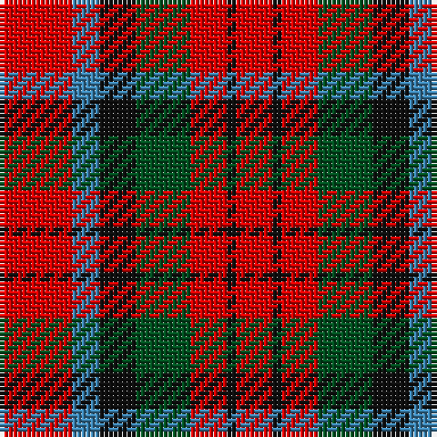

The parent of this is [MacDuff #5](/tartans/r/16/b6/k8/g12/r8/k2/r/8/)

This was sourced from register-of-tartans.  It is a [7 stripes tartan](/stripes/stripes7/).

Original link https://www.tartanregister.gov.uk/tartanDetails.aspx?ref=2417

## Thread count
R/16 B6 K8 G12 R8 K2 R/8

## Palette
Each colour and its ΔE from the base-6 reference it is a variant of.

| Colour | Shade | Base | ΔE (OKLab) |
|---|---|---|---|
| B |  `#3C82AF` | B  | 0.20 |
| G |  `#005020` | G  | 0.08 |
| K |  `#101010` | K  | 0.17 |
| R |  `#DC0000` | R  | 0.04 |

# Sample pattern

ID: /variants/r/16/b6/k8/g12/r8/k2/r/8-b3c82af-g005020-k101010-rdc0000/
