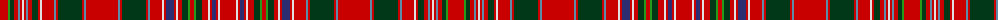

The parent of this is [MacAlister Clan Tartan Tartan Number: 1465. Earliest known date: 1850 This plate is taken from the manuscript of William and Andrew Smith's 'Authenticated Tartans of the Clans and Families of Scotland'. The Smith's sources included the findings of George Hunter, an Army clothier, who toured the Highlands in search of old tartans prior to 1822. MacAlisters are descendants of Donald of Islay, Lord of the Isles. Contemporary accounts of Flora MacDonald (1746) suggest that MacAlisters wore the MacDonald tartan at that time. The MacAlister tartan certified by the chief in 1816 shows the MacDonald connection in its design. The present day Chief MacAlister of Loup was granted by Lord Lyon in 1991. See products available Copyright © Blair Urquhart, Comrie, 2015](/tartans/r/16/g2/dg4/r4/b2/r2/ln2/r2/b2/r4/dg6/r2/ln2/r12/b2/r2/dg24/r2/b2/r32/b2/r2/dg24/r2/b2/r12/ln2/r2/db8/r2/ln2/r4/dg6/g2/r4/g2/dg6/r6/ln2/r2/db4/r2/ln2/r/16/)

This was sourced from house-of-tartan.  It is a [44 stripes tartan](/stripes/stripes44/).

Original link http://www.house-of-tartan.scotland.net/house/TartanViewjs.asp?colr=Def&tnam=1465

## Thread count
R/16 G2 DG4 R4 B2 R2 LN2 R2 B2 R4 DG6 R2 LN2 R12 B2 R2 DG24 R2 B2 R32 B2 R2 DG24 R2 B2 R12 LN2 R2 DB8 R2 LN2 R4 DG6 G2 R4 G2 DG6 R6 LN2 R2 DB4 R2 LN2 R/16

## Palette
Each colour and its ΔE from the base-6 reference it is a variant of.

| Colour | Shade | Base | ΔE (OKLab) |
|---|---|---|---|
| B |  `#5C8CA8` | B  | 0.23 |
| DB |  `#2C2C70` | B  | 0.06 |
| DG |  `#003818` | G  | 0.16 |
| G |  `#289C18` | G  | 0.18 |
| LN |  `#E0E0E0` | W  | 0.06 |
| R |  `#C80000` | R  | 0.00 |

ID: /variants/r/16/g2/dg4/r4/b2/r2/ln2/r2/b2/r4/dg6/r2/ln2/r12/b2/r2/dg24/r2/b2/r32/b2/r2/dg24/r2/b2/r12/ln2/r2/db8/r2/ln2/r4/dg6/g2/r4/g2/dg6/r6/ln2/r2/db4/r2/ln2/r/16-b5c8ca8-db2c2c70-dg003818-g289c18-lne0e0e0-rc80000/
