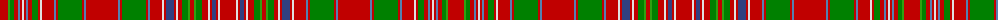

The parent of this is [MacAlister](/tartans/r/16/g2/ga4/r4/ba2/r2/ln2/r2/ba2/r4/ga6/r2/ln2/r12/ba2/r2/ga24/r2/ba2/r32/ba2/r2/ga24/r2/ba2/r12/ln2/r2/b8/r2/ln2/r4/ga6/g2/r4/g2/ga6/r6/ln2/r2/b4/r2/ln2/r/16/)

This was sourced from weddslist.  It is a [44 stripes tartan](/stripes/stripes44/).

Original link http://www.weddslist.com/cgi-bin/tartans/pg.pl?source=sts

## Thread count
R/16 G2 Ga4 R4 Ba2 R2 LN2 R2 Ba2 R4 Ga6 R2 LN2 R12 Ba2 R2 Ga24 R2 Ba2 R32 Ba2 R2 Ga24 R2 Ba2 R12 LN2 R2 B8 R2 LN2 R4 Ga6 G2 R4 G2 Ga6 R6 LN2 R2 B4 R2 LN2 R/16

## Palette
Each colour and its ΔE from the base-6 reference it is a variant of.

| Colour | Shade | Base | ΔE (OKLab) |
|---|---|---|---|
| B |  `#304080` | B  | 0.01 |
| Ba |  `#5480B0` | B  | 0.20 |
| G |  `#30A010` | G  | 0.19 |
| Ga |  `#008000` | G  | 0.09 |
| LN |  `#E0E0E0` | W  | 0.06 |
| R |  `#C00000` | R  | 0.02 |

ID: /variants/r/16/g2/ga4/r4/ba2/r2/ln2/r2/ba2/r4/ga6/r2/ln2/r12/ba2/r2/ga24/r2/ba2/r32/ba2/r2/ga24/r2/ba2/r12/ln2/r2/b8/r2/ln2/r4/ga6/g2/r4/g2/ga6/r6/ln2/r2/b4/r2/ln2/r/16-b304080-ba5480b0-g30a010-ga008000-lne0e0e0-rc00000/
