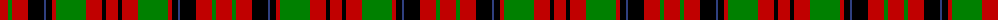

The parent of this is [MacNicol](/tartans/r/16/g4/r16/k16/b2/k6/r4/g30/r16/k4/r/12/)

This was sourced from weddslist.  It is a [11 stripes tartan](/stripes/stripes11/).

Original link http://www.weddslist.com/cgi-bin/tartans/pg.pl?source=sts

## Thread count
R/16 G4 R16 K16 B2 K6 R4 G30 R16 K4 R/12

## Palette
Each colour and its ΔE from the base-6 reference it is a variant of.

| Colour | Shade | Base | ΔE (OKLab) |
|---|---|---|---|
| B |  `#304080` | B  | 0.01 |
| G |  `#008000` | G  | 0.09 |
| K |  `#000000` | K  | 0.00 |
| R |  `#C00000` | R  | 0.02 |

ID: /variants/r/16/g4/r16/k16/b2/k6/r4/g30/r16/k4/r/12-b304080-g008000-k000000-rc00000/
