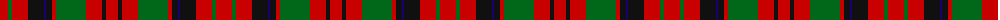

The parent of this is [MacNicol/Nicolson (Inverness Tweed Mill Co Ltd)](/tartans/r/16/g4/r16/k16/db2/k6/r4/g30/r16/k4/r/12/)

This was sourced from register-of-tartans.  It is a [11 stripes tartan](/stripes/stripes11/).

Original link https://www.tartanregister.gov.uk/tartanDetails.aspx?ref=2692

## Thread count
R/16 G4 R16 K16 DB2 K6 R4 G30 R16 K4 R/12

## Palette
Each colour and its ΔE from the base-6 reference it is a variant of.

| Colour | Shade | Base | ΔE (OKLab) |
|---|---|---|---|
| DB |  `#1C0070` | B  | 0.14 |
| DR |  `#880000` | R  | 0.14 |
| G |  `#006818` | G  | 0.02 |
| K |  `#101010` | K  | 0.17 |
| R |  `#C80000` | R  | 0.00 |

ID: /variants/r/16/g4/r16/k16/db2/k6/r4/g30/r16/k4/r/12-db1c0070-dr880000-g006818-k101010-rc80000/
