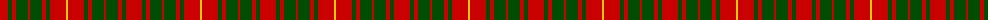

The parent of this is [Bruce](/tartans/r/16/g4/r4/g12/r2/g12/r4/g4/r16/y/2/)

This was sourced from weddslist.  It is a [10 stripes tartan](/stripes/stripes10/).

Original link http://www.weddslist.com/cgi-bin/tartans/pg.pl?source=rb

## Thread count
R/16 G4 R4 G12 R2 G12 R4 G4 R16 Y/2

## Palette
Each colour and its ΔE from the base-6 reference it is a variant of.

| Colour | Shade | Base | ΔE (OKLab) |
|---|---|---|---|
| G |  `#004C00` | G  | 0.08 |
| R |  `#C80000` | R  | 0.00 |
| Y |  `#FFC800` | Y  | 0.04 |

ID: /variants/r/16/g4/r4/g12/r2/g12/r4/g4/r16/y/2-g004c00-rc80000-yffc800/
