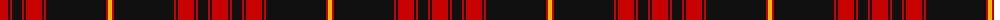

The parent of this is [Calgary, University of (Corporate)](/tartans/r/16/k2/r2/k10/r2/k2/r16/k2/r2/k60/r2/y/4/)

This was sourced from tartans-authority.  It is a [12 stripes tartan](/stripes/stripes12/).

Original link http://www.tartansauthority.com/tartan-ferret/display/4004/

## Thread count
R/16 K2 R2 K10 R2 K2 R16 K2 R2 K60 R2 Y/4

## Palette
Each colour and its ΔE from the base-6 reference it is a variant of.

| Colour | Shade | Base | ΔE (OKLab) |
|---|---|---|---|
| K |  `#101010` | K  | 0.17 |
| R |  `#C80000` | R  | 0.00 |
| Y |  `#E8C000` | Y  | 0.00 |

ID: /variants/r/16/k2/r2/k10/r2/k2/r16/k2/r2/k60/r2/y/4-k101010-rc80000-ye8c000/
