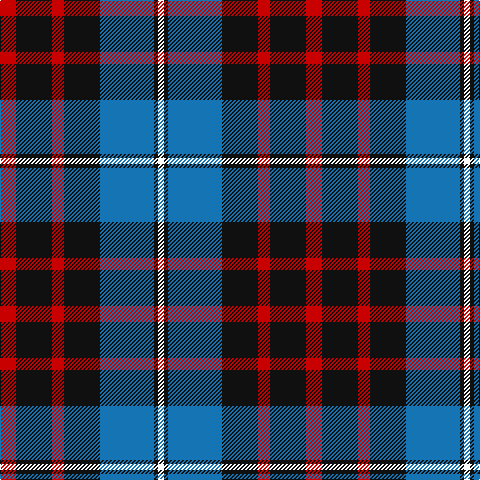

The parent of this is [MacKean (Personal)](/tartans/r/16/k36/r12/k36/b54/k4/w/6/)

This was sourced from register-of-tartans.  It is a [7 stripes tartan](/stripes/stripes7/).

Original link https://www.tartanregister.gov.uk/tartanDetails.aspx?ref=2508

## Thread count
R/16 K36 R12 K36 B54 K4 W/6

## Palette
Each colour and its ΔE from the base-6 reference it is a variant of.

| Colour | Shade | Base | ΔE (OKLab) |
|---|---|---|---|
| B |  `#1474B4` | B  | 0.15 |
| K |  `#101010` | K  | 0.17 |
| R |  `#C80000` | R  | 0.00 |
| W |  `#FCFCFC` | W  | 0.03 |

# Sample pattern

ID: /variants/r/16/k36/r12/k36/b54/k4/w/6-b1474b4-k101010-rc80000-wfcfcfc/
