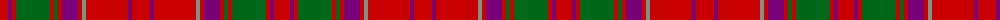

The parent of this is [London Caledonian Games Assoc.(Corp)](/tartans/r/16/p4/r4/g34/r4/g4/r4/p16/r4/lg4/r42/p4/r/18/)

This was sourced from tartans-authority.  It is a [13 stripes tartan](/stripes/stripes13/).

Original link http://www.tartansauthority.com/tartan-ferret/display/1388/

## Thread count
R/16 P4 R4 G34 R4 G4 R4 P16 R4 LG4 R42 P4 R/18

## Palette
Each colour and its ΔE from the base-6 reference it is a variant of.

| Colour | Shade | Base | ΔE (OKLab) |
|---|---|---|---|
| G |  `#006818` | G  | 0.02 |
| LG |  `#789484` | G  | 0.23 |
| P |  `#780078` | B  | 0.16 |
| R |  `#C80000` | R  | 0.00 |

ID: /variants/r/16/p4/r4/g34/r4/g4/r4/p16/r4/lg4/r42/p4/r/18-g006818-lg789484-p780078-rc80000/
