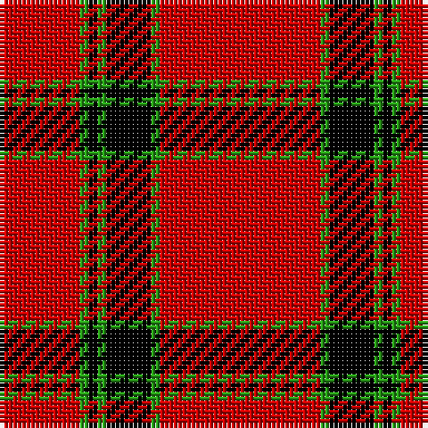

The parent of this is [Duke of Sussex (Royal)](/tartans/r/18/g2/k2/g2/k10/g2/r/36/)

This was sourced from tartans-authority.  It is a [7 stripes tartan](/stripes/stripes7/).

Original link http://www.tartansauthority.com/tartan-ferret/display/5265/

## Thread count
R/18 G2 K2 G2 K10 G2 R/36

## Palette
Each colour and its ΔE from the base-6 reference it is a variant of.

| Colour | Shade | Base | ΔE (OKLab) |
|---|---|---|---|
| G |  `#289C18` | G  | 0.18 |
| K |  `#000000` | K  | 0.00 |
| R |  `#C80000` | R  | 0.00 |

# Sample pattern

ID: /variants/r/18/g2/k2/g2/k10/g2/r/36-g289c18-k000000-rc80000/
