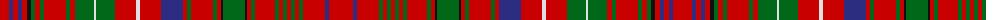

The parent of this is [MacDonald of Staffa Clan Tartan Tartan Number: 1387. Earliest known date: 1819 Reduced by 60% for display. Until recently the various branches of the Clan Donald were regarded as independant clans in their own right. In 1947 the Mac Dhomnuill was re-instated by Lord Lyon. See products available Copyright © Blair Urquhart, Comrie, 2015](/tartans/r/19/db4/r5/db4/r5/k4/g4/r5/g4/r22/g4/r5/g19/ln2/g19/r21/ln4/r21/db22/r4/g4/r22/g4/r4/k2/g22/k2/r4/g4/r20/g4/r4/g4/r4/g4/r4/g4/r22/db4/r/24/)

This was sourced from house-of-tartan.  It is a [40 stripes tartan](/stripes/stripes40/).

Original link http://www.house-of-tartan.scotland.net/house/TartanViewjs.asp?colr=Def&tnam=1387

## Thread count
R/19 DB4 R5 DB4 R5 K4 G4 R5 G4 R22 G4 R5 G19 LN2 G19 R21 LN4 R21 DB22 R4 G4 R22 G4 R4 K2 G22 K2 R4 G4 R20 G4 R4 G4 R4 G4 R4 G4 R22 DB4 R/24

## Palette
Each colour and its ΔE from the base-6 reference it is a variant of.

| Colour | Shade | Base | ΔE (OKLab) |
|---|---|---|---|
| DB |  `#2C2C80` | B  | 0.05 |
| G |  `#006818` | G  | 0.02 |
| K |  `#101010` | K  | 0.17 |
| LN |  `#E0E0E0` | W  | 0.06 |
| R |  `#C80000` | R  | 0.00 |

ID: /variants/r/19/db4/r5/db4/r5/k4/g4/r5/g4/r22/g4/r5/g19/ln2/g19/r21/ln4/r21/db22/r4/g4/r22/g4/r4/k2/g22/k2/r4/g4/r20/g4/r4/g4/r4/g4/r4/g4/r22/db4/r/24-db2c2c80-g006818-k101010-lne0e0e0-rc80000/
