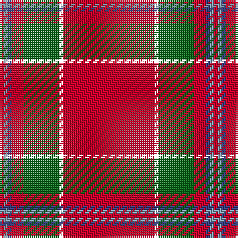

The parent of this is [Perthshire Clayquhat District Tartan Tartan Number: 2800. Earliest known date: c.1739 Early historic plaid woven for (or by) Janet Craigie (nee Spalding) from the Braes of Clayquhat (now Cloquhat) in East Perthshire. Two pieces are now in the possession of the Scottish Tartans Authority (2014). See http://scottishtartans.co.uk/An_Unnamed_C18th_Plaid_from_Bridge_of_Cally.pdf See products available Copyright © Blair Urquhart, Comrie, 2015](/tartans/r/2/b2/ba2/r6/g18/xb2/r/46/)

This was sourced from house-of-tartan.  It is a [7 stripes tartan](/stripes/stripes7/).

Original link http://www.house-of-tartan.scotland.net/house/TartanViewjs.asp?colr=Def&tnam=2800

## Thread count
R/2 B2 Ba2 R6 G18 XB2 R/46

## Palette
Each colour and its ΔE from the base-6 reference it is a variant of.

| Colour | Shade | Base | ΔE (OKLab) |
|---|---|---|---|
| B |  `#809CB0` | Y  | 0.25 |
| Ba |  `#384080` | B  | 0.02 |
| G |  `#086818` | G  | 0.02 |
| R |  `#C8002C` | R  | 0.03 |

# Sample pattern

ID: /variants/r/2/b2/ba2/r6/g18/xb2/r/46-b809cb0-ba384080-g086818-rc8002c/
