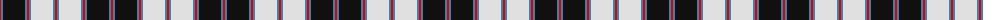

The parent of this is [MacPherson #4](/tartans/r/2/b2/k22/b2/r2/b2/ln22/b2/r/2/)

This was sourced from register-of-tartans.  It is a [9 stripes tartan](/stripes/stripes9/).

Original link https://www.tartanregister.gov.uk/tartanDetails.aspx?ref=2705

## Thread count
R/2 B2 K22 B2 R2 B2 LN22 B2 R/2

## Palette
Each colour and its ΔE from the base-6 reference it is a variant of.

| Colour | Shade | Base | ΔE (OKLab) |
|---|---|---|---|
| B |  `#3C82AF` | B  | 0.20 |
| K |  `#101010` | K  | 0.17 |
| LN |  `#E0E0E0` | W  | 0.06 |
| R |  `#DC0000` | R  | 0.04 |

ID: /variants/r/2/b2/k22/b2/r2/b2/ln22/b2/r/2-b3c82af-k101010-lne0e0e0-rdc0000/
