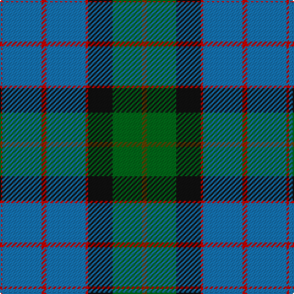

The parent of this is [MacWilliam](/tartans/r/2/b32/r4/b32/r2/k20/g24/t/4/)

This was sourced from register-of-tartans.  It is a [8 stripes tartan](/stripes/stripes8/).

Original link https://www.tartanregister.gov.uk/tartanDetails.aspx?ref=2776

## Thread count
R/2 B32 R4 B32 R2 K20 G24 T/4

## Palette
Each colour and its ΔE from the base-6 reference it is a variant of.

| Colour | Shade | Base | ΔE (OKLab) |
|---|---|---|---|
| B |  `#1474B4` | B  | 0.15 |
| G |  `#006818` | G  | 0.02 |
| K |  `#101010` | K  | 0.17 |
| R |  `#C80000` | R  | 0.00 |
| T |  `#604000` | G  | 0.14 |

# Sample pattern

ID: /variants/r/2/b32/r4/b32/r2/k20/g24/t/4-b1474b4-g006818-k101010-rc80000-t604000/
