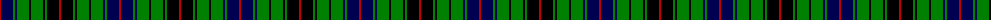

The parent of this is [Davidson](/tartans/r/2/db12/g2/db2/g12/k2/g12/k2/g2/k12/r/2/)

This was sourced from weddslist.  It is a [11 stripes tartan](/stripes/stripes11/).

Original link http://www.weddslist.com/cgi-bin/tartans/pg.pl?source=sts

## Thread count
R/2 DB12 G2 DB2 G12 K2 G12 K2 G2 K12 R/2

## Palette
Each colour and its ΔE from the base-6 reference it is a variant of.

| Colour | Shade | Base | ΔE (OKLab) |
|---|---|---|---|
| DB |  `#000050` | B  | 0.20 |
| G |  `#008000` | G  | 0.09 |
| K |  `#000000` | K  | 0.00 |
| R |  `#C00000` | R  | 0.02 |

ID: /variants/r/2/db12/g2/db2/g12/k2/g12/k2/g2/k12/r/2-db000050-g008000-k000000-rc00000/
