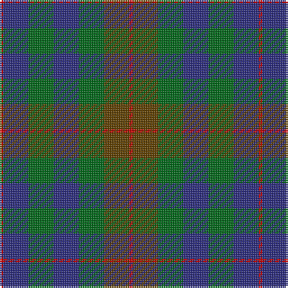

The parent of this is [Tennant (Yules)](/tartans/r/2/db14/g14/db14/g14/t14/r/2/)

This was sourced from register-of-tartans.  It is a [7 stripes tartan](/stripes/stripes7/).

Original link https://www.tartanregister.gov.uk/tartanDetails.aspx?ref=4090

## Thread count
R/2 DB14 G14 DB14 G14 T14 R/2

## Palette
Each colour and its ΔE from the base-6 reference it is a variant of.

| Colour | Shade | Base | ΔE (OKLab) |
|---|---|---|---|
| DB |  `#2C2C80` | B  | 0.05 |
| G |  `#006818` | G  | 0.02 |
| R |  `#C80000` | R  | 0.00 |
| T |  `#604000` | G  | 0.14 |

# Sample pattern

ID: /variants/r/2/db14/g14/db14/g14/t14/r/2-db2c2c80-g006818-rc80000-t604000/
