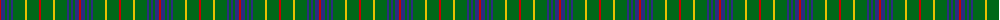

The parent of this is [Ayrton Laoch Family Tartan Tartan Number: 1330. Earliest known date: 1982 The weaving and wearing of this tartan is 'Restricted'. This is not a legal definition and is applied by the Scottish Tartans Society irrespective of Design Patent or Copyright, in the spirit of a gentlemans agreement. Interested parties should contact the person listed under 'Source:' in this document. See products available Copyright © Blair Urquhart, Comrie, 2015](/tartans/r/2/db4/g2/db2/g2/db2/g12/y2/g12/r/2/)

This was sourced from house-of-tartan.  It is a [10 stripes tartan](/stripes/stripes10/).

Original link http://www.house-of-tartan.scotland.net/house/TartanViewjs.asp?colr=Def&tnam=1330

## Thread count
R/2 DB4 G2 DB2 G2 DB2 G12 Y2 G12 R/2

## Palette
Each colour and its ΔE from the base-6 reference it is a variant of.

| Colour | Shade | Base | ΔE (OKLab) |
|---|---|---|---|
| DB |  `#2C2C80` | B  | 0.05 |
| G |  `#006818` | G  | 0.02 |
| R |  `#C80000` | R  | 0.00 |
| Y |  `#E8C000` | Y  | 0.00 |

ID: /variants/r/2/db4/g2/db2/g2/db2/g12/y2/g12/r/2-db2c2c80-g006818-rc80000-ye8c000/
