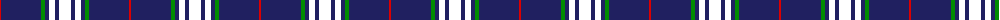
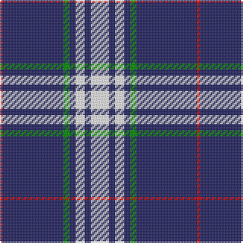

The parent of this is [Gonzaga University’s True Blue and White](/tartans/r/2/db40/g4/db4/w6/db4/w/12/)

This was sourced from register-of-tartans.  It is a [7 stripes tartan](/stripes/stripes7/).

Original link https://www.tartanregister.gov.uk/tartanDetails.aspx?ref=11068

## Thread count
R/2 DB40 G4 DB4 W6 DB4 W/12

## Palette
Each colour and its ΔE from the base-6 reference it is a variant of.

| Colour | Shade | Base | ΔE (OKLab) |
|---|---|---|---|
| DB |  `#202060` | B  | 0.11 |
| G |  `#008B00` | G  | 0.12 |
| R |  `#DC0000` | R  | 0.04 |
| W |  `#FFFFFF` | W  | 0.03 |

# Sample pattern

ID: /variants/r/2/db40/g4/db4/w6/db4/w/12-db202060-g008b00-rdc0000-wffffff/
