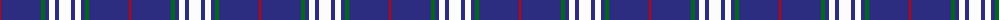
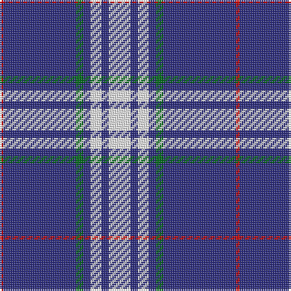

The parent of this is [Gonzaga University's True Blue and W](/tartans/r/2/db40/g4/db4/w6/db4/w/12/)

This was sourced from tartans-authority.  It is a [7 stripes tartan](/stripes/stripes7/).

Original link http://www.tartansauthority.com/tartan-ferret/display/11068/

## Thread count
R/2 DB40 G4 DB4 W6 DB4 W/12

## Palette
Each colour and its ΔE from the base-6 reference it is a variant of.

| Colour | Shade | Base | ΔE (OKLab) |
|---|---|---|---|
| DB |  `#2C2C80` | B  | 0.05 |
| G |  `#006818` | G  | 0.02 |
| R |  `#C80000` | R  | 0.00 |
| W |  `#FCFCFC` | W  | 0.03 |

# Sample pattern

ID: /variants/r/2/db40/g4/db4/w6/db4/w/12-db2c2c80-g006818-rc80000-wfcfcfc/
