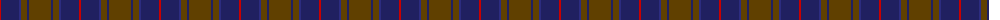
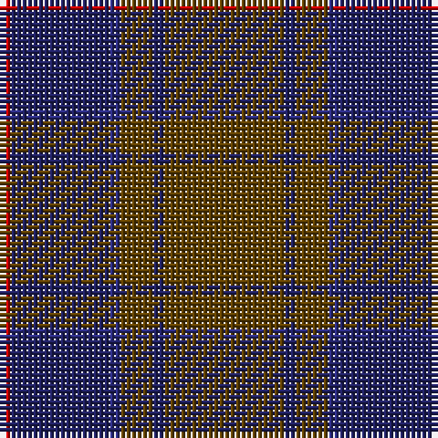

The parent of this is [Dege of Saville Row Corporate Tartan Tartan Number: 2112. Earliest known date: 1990 The choice of design and colours reflects the history and tradition of Dege of Saville Row and its relationship to country life and sporting activities since 1865. Dege make high quality ceremonial and military dress. See products available Copyright © Blair Urquhart, Comrie, 2015](/tartans/r/2/dba18/db2/t6/dba2/t/22/)

This was sourced from house-of-tartan.  It is a [6 stripes tartan](/stripes/stripes6/).

Original link http://www.house-of-tartan.scotland.net/house/TartanViewjs.asp?colr=Def&tnam=2112

## Thread count
R/2 DBa18 DB2 T6 DBa2 T/22

## Palette
Each colour and its ΔE from the base-6 reference it is a variant of.

| Colour | Shade | Base | ΔE (OKLab) |
|---|---|---|---|
| DB |  `#2C2C80` | B  | 0.05 |
| DBa |  `#202060` | B  | 0.11 |
| R |  `#C80000` | R  | 0.00 |
| T |  `#604000` | G  | 0.14 |

# Sample pattern

ID: /variants/r/2/dba18/db2/t6/dba2/t/22-db2c2c80-dba202060-rc80000-t604000/
