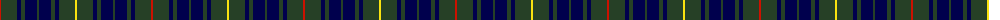

The parent of this is [Bruce of Crionaich (Personal)](/tartans/r/2/dn16/db4/dn4/db12/dn2/db12/dn4/db4/dn16/y/2/)

This was sourced from register-of-tartans.  It is a [11 stripes tartan](/stripes/stripes11/).

Original link https://www.tartanregister.gov.uk/tartanDetails.aspx?ref=10370

## Thread count
R/2 DN16 DB4 DN4 DB12 DN2 DB12 DN4 DB4 DN16 Y/2

## Palette
Each colour and its ΔE from the base-6 reference it is a variant of.

| Colour | Shade | Base | ΔE (OKLab) |
|---|---|---|---|
| DB |  `#00004D` | B  | 0.21 |
| DN |  `#264026` | G  | 0.13 |
| R |  `#CC1100` | R  | 0.01 |
| Y |  `#F9E210` | Y  | 0.09 |

ID: /variants/r/2/dn16/db4/dn4/db12/dn2/db12/dn4/db4/dn16/y/2-db00004d-dn264026-rcc1100-yf9e210/
