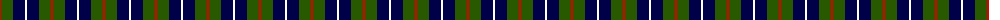
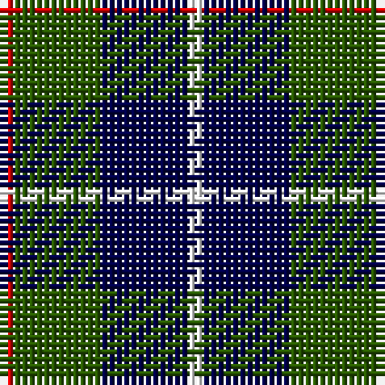

The parent of this is [Salt Spring Island](/tartans/r/2/g12/db12/w/2/)

This was sourced from register-of-tartans.  It is a [4 stripes tartan](/stripes/stripes4/).

Original link https://www.tartanregister.gov.uk/tartanDetails.aspx?ref=11409

## Thread count
R/2 G12 DB12 W/2

## Palette
Each colour and its ΔE from the base-6 reference it is a variant of.

| Colour | Shade | Base | ΔE (OKLab) |
|---|---|---|---|
| DB |  `#000048` | B  | 0.21 |
| G |  `#285800` | G  | 0.04 |
| R |  `#DC0000` | R  | 0.04 |
| W |  `#FFFFFF` | W  | 0.03 |

# Sample pattern

ID: /variants/r/2/g12/db12/w/2-db000048-g285800-rdc0000-wffffff/
