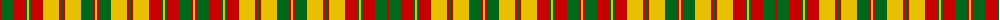

The parent of this is [Strathearn](/tartans/r/2/g12/r12/g2/y2/g2/r12/y16/r2/g2/r2/y16/g12/r2/y2/r2/g12/y16/r2/g2/r2/y16/r12/g2/y2/g2/r12/g12/r2/y/2/)

This was sourced from register-of-tartans.  It is a [30 stripes tartan](/stripes/stripes30/).

Original link https://www.tartanregister.gov.uk/tartanDetails.aspx?ref=3984

## Thread count
R/2 G12 R12 G2 Y2 G2 R12 Y16 R2 G2 R2 Y16 G12 R2 Y2 R2 G12 Y16 R2 G2 R2 Y16 R12 G2 Y2 G2 R12 G12 R2 Y/2

## Palette
Each colour and its ΔE from the base-6 reference it is a variant of.

| Colour | Shade | Base | ΔE (OKLab) |
|---|---|---|---|
| G |  `#006818` | G  | 0.02 |
| R |  `#C80000` | R  | 0.00 |
| Y |  `#E8C000` | Y  | 0.00 |

ID: /variants/r/2/g12/r12/g2/y2/g2/r12/y16/r2/g2/r2/y16/g12/r2/y2/r2/g12/y16/r2/g2/r2/y16/r12/g2/y2/g2/r12/g12/r2/y/2-g006818-rc80000-ye8c000/
