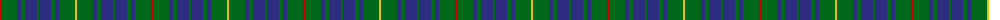

The parent of this is [Bruce of Crionaich (Personal)](/tartans/r/2/g16/db4/g4/db12/g2/db12/g4/db4/g16/y/2/)

This was sourced from tartans-authority.  It is a [11 stripes tartan](/stripes/stripes11/).

Original link http://www.tartansauthority.com/tartan-ferret/display/10370/

## Thread count
R/2 G16 DB4 G4 DB12 G2 DB12 G4 DB4 G16 Y/2

## Palette
Each colour and its ΔE from the base-6 reference it is a variant of.

| Colour | Shade | Base | ΔE (OKLab) |
|---|---|---|---|
| DB |  `#2C2C80` | B  | 0.05 |
| G |  `#006818` | G  | 0.02 |
| R |  `#C80000` | R  | 0.00 |
| Y |  `#E8C000` | Y  | 0.00 |

ID: /variants/r/2/g16/db4/g4/db12/g2/db12/g4/db4/g16/y/2-db2c2c80-g006818-rc80000-ye8c000/
