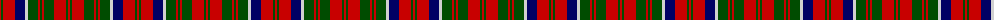

The parent of this is [Matheson N](/tartans/r/2/g2/r12/db10/n3/g10/r2/g2/r2/g10/r12/g2/r/2/)

This was sourced from weddslist.  It is a [13 stripes tartan](/stripes/stripes13/).

Original link http://www.weddslist.com/cgi-bin/tartans/pg.pl?source=rb

## Thread count
R/2 G2 R12 DB10 N3 G10 R2 G2 R2 G10 R12 G2 R/2

## Palette
Each colour and its ΔE from the base-6 reference it is a variant of.

| Colour | Shade | Base | ΔE (OKLab) |
|---|---|---|---|
| DB |  `#000064` | B  | 0.17 |
| G |  `#004C00` | G  | 0.08 |
| N |  `#D0D0D0` | W  | 0.11 |
| R |  `#C80000` | R  | 0.00 |

ID: /variants/r/2/g2/r12/db10/n3/g10/r2/g2/r2/g10/r12/g2/r/2-db000064-g004c00-nd0d0d0-rc80000/
