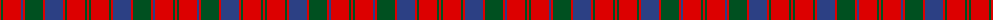

The parent of this is [Robertson #3](/tartans/r/2/g2/r18/b2/r2/g18/r2/b18/r2/g2/r18/g2/r/2/)

This was sourced from register-of-tartans.  It is a [13 stripes tartan](/stripes/stripes13/).

Original link https://www.tartanregister.gov.uk/tartanDetails.aspx?ref=3524

## Thread count
R/2 G2 R18 B2 R2 G18 R2 B18 R2 G2 R18 G2 R/2

## Palette
Each colour and its ΔE from the base-6 reference it is a variant of.

| Colour | Shade | Base | ΔE (OKLab) |
|---|---|---|---|
| B |  `#2C4084` | B  | 0.00 |
| G |  `#005020` | G  | 0.08 |
| R |  `#DC0000` | R  | 0.04 |

ID: /variants/r/2/g2/r18/b2/r2/g18/r2/b18/r2/g2/r18/g2/r/2-b2c4084-g005020-rdc0000/
