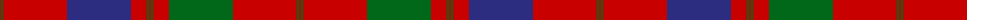

The parent of this is [Grant of Rothiemurchus Artifact Tartan Tartan Number: 1496. Earliest known date: pre 2003 From a wedding plaid recorded by Miss M. MacDougall. See products available Copyright © Blair Urquhart, Comrie, 2015](/tartans/r/2/g2/r64/db64/r16/g2/r2/g2/r16/g64/r64/g2/r/2/)

This was sourced from house-of-tartan.  It is a [13 stripes tartan](/stripes/stripes13/).

Original link http://www.house-of-tartan.scotland.net/house/TartanViewjs.asp?colr=Def&tnam=1496

## Thread count
R/2 G2 R64 DB64 R16 G2 R2 G2 R16 G64 R64 G2 R/2

## Palette
Each colour and its ΔE from the base-6 reference it is a variant of.

| Colour | Shade | Base | ΔE (OKLab) |
|---|---|---|---|
| DB |  `#2C2C80` | B  | 0.05 |
| G |  `#006818` | G  | 0.02 |
| R |  `#C80000` | R  | 0.00 |

ID: /variants/r/2/g2/r64/db64/r16/g2/r2/g2/r16/g64/r64/g2/r/2-db2c2c80-g006818-rc80000/
