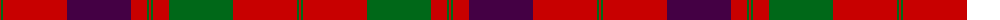

The parent of this is [Unnamed 18th century plaid from Rothiemurchus](/tartans/r/2/g2/r64/dp64/r16/g2/r2/g2/r16/g64/r64/g2/r/2/)

This was sourced from register-of-tartans.  It is a [13 stripes tartan](/stripes/stripes13/).

Original link https://www.tartanregister.gov.uk/tartanDetails.aspx?ref=1511

## Thread count
R/2 G2 R64 DP64 R16 G2 R2 G2 R16 G64 R64 G2 R/2

## Palette
Each colour and its ΔE from the base-6 reference it is a variant of.

| Colour | Shade | Base | ΔE (OKLab) |
|---|---|---|---|
| DG |  `#003820` | G  | 0.16 |
| DP |  `#440044` | B  | 0.17 |
| G |  `#006818` | G  | 0.02 |
| R |  `#C80000` | R  | 0.00 |

ID: /variants/r/2/g2/r64/dp64/r16/g2/r2/g2/r16/g64/r64/g2/r/2-dg003820-dp440044-g006818-rc80000/
